# Analisis  Mecanismo Biela-Manivela con Velocidad Angular de Entrada constante
___

Es un programa hecho en matlab usando GUIDE para el analisis de posiciones, velocidades y grashof de un Mecanismo 4 barras de Tipo Biela-Manivela con Velocidad Angular de entrada constante.

Los datos que utiliza para el analisis son:
* Angulo de Entrada (θ2)
* Velocidad Angular de entrada (ω2)
* Longitud del eslabon 2
* Longitud del eslabon 3

## Como se Utiliza?
---
1. Abrir Matlab
1. Dirigirse a la Command Window, escribir **_guide_** y presionar ENTER.  
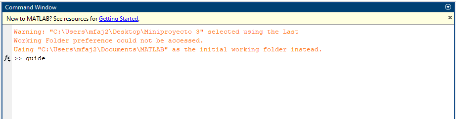
1. Se abrirá la ventana _Guide Quick Start_. Se debe presionar el boton _Browse_ para seleccionar el archivo.  
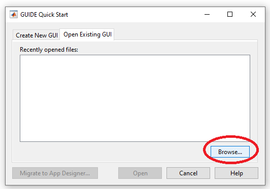
1. Allí se debe buscar y seleccionar el archivo _.fig_ que corresponde al programa.  
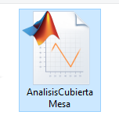
1. Aparecerá una ventana que dará la opción de Cambiar el folder. Darle click al botón _Change Folder_.  
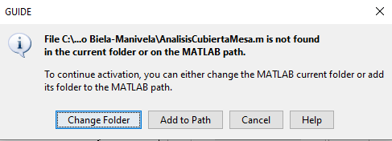
1. Se abrirá el programa con todas las opciones para editar su funcionamiento e interfaz. Si no se desea editar nada, no es necesario hacer cambios.  
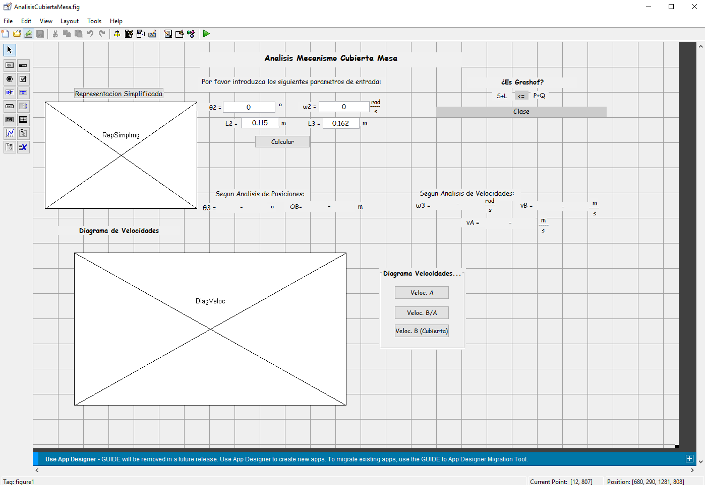
1. Para ejecutar el programa final presionar el botón _Run_.  
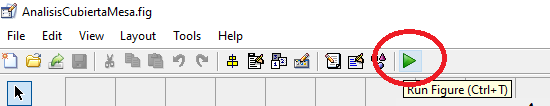
1. Se mostrara el programa listo para ser utilizado.  
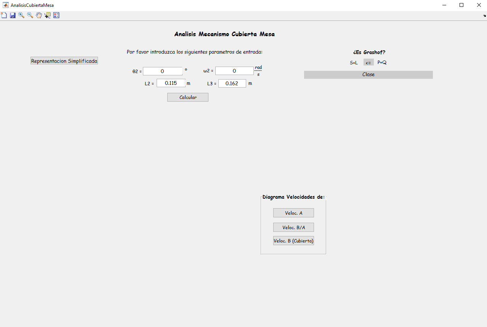
1.  Dando click al botón _Representacion Simplificada_ se tendrá una vista del diagrama en base al cual se denominan las variables. El mismo también es útil para considerar la dirección de los angulos. 
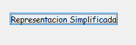
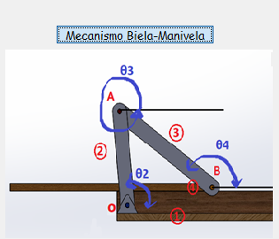  
Dando Click al botón _Mecanismo Biela-Manivela_ se ocultará el diagrama.  
1. El programa solicita introducir los parametros de entrada. Una vez se hayan colocado al presionar el botón _Calcular_ se tendrá todo el analisis del mecanismo.  
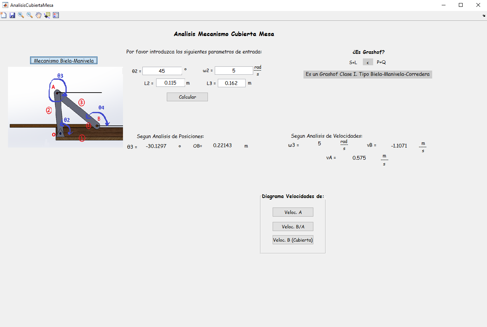
Aquí concluye si el mecanismo es Grashof y la clase. Se arrojan los resultados del analisis de posiciones y velocidades. 
La sección inferior muestra los gráficos con los resultados de velocidades según la posición del angulo de entrada.
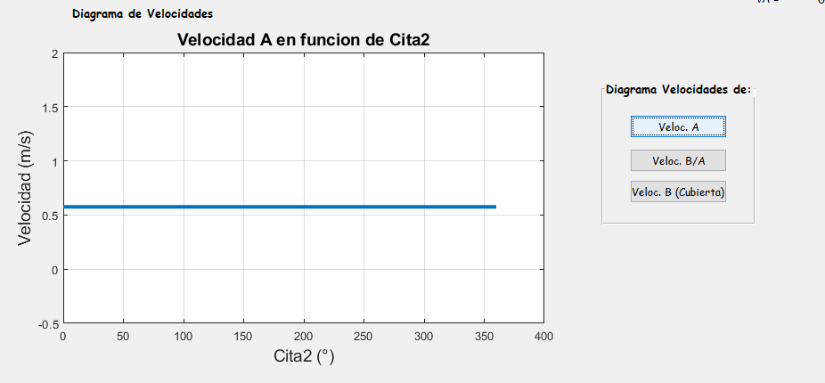
 

___
___
